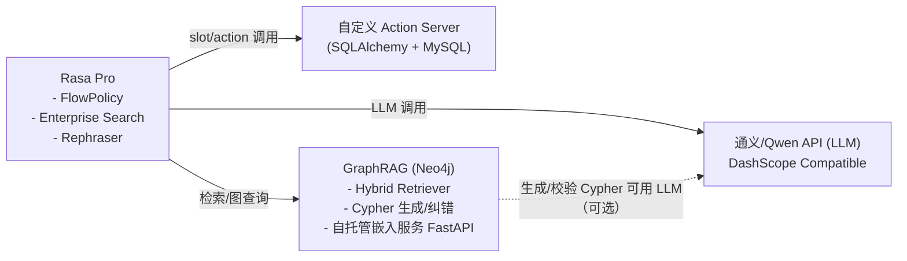
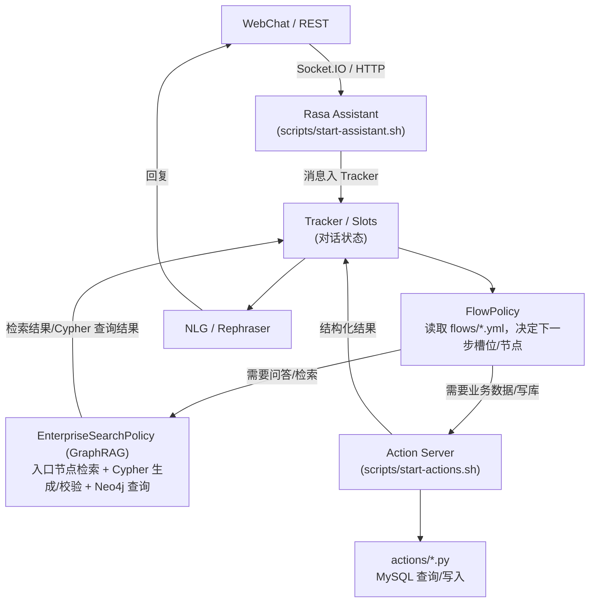

# Rasa ECS 智能客服项目

面向电商场景的智能客服，基于 **Rasa Pro Flow + Enterprise Search Policy + GraphRAG** 构建，支持订单管理、物流跟踪、售后办理及知识库问答，默认集成阿里云通义系列 LLM、Neo4j 图谱、MySQL 业务库与本地 BGE 向量服务。

## 关键特性

- **流程驱动对话**：`FlowPolicy` + `data/flows/*.yml` 将用户意图映射到可视化流程，覆盖换账号、查单、改地址、取消订单、投诉物流、售后等业务。
- **业务数据库联动**：`actions/*.py` 通过 SQLAlchemy 访问 MySQL `ecs` 库，复用订单、物流、售后等真实数据并支撑批量演示数据生成。
- **GraphRAG 检索**：`addons/information_retrieval.py` 将 Neo4j 知识图谱、BGE 向量和全文索引结合，内置标签路由、节点检索、Cypher 生成/验证/纠错的完整链路。
- **多模型协同**：`endpoints.yml` 中的 `model_groups` 配置通义 Qwen（指令、Coder、重写器）和本地 `bge-base-zh-v1.5` 嵌入模型，可按需切换/扩展。
- **可观测与测试**：`e2e_tests/` 搭配 `e2e_coverage_results/` 帮助回归主要对话链路；`output/` 记录 LLM Command Generator 导出的训练数据、参数和指标。

## 产品设计概览（业务视角）

### 1. 场景与目标

- **适用场景**：电商平台在售前（商品咨询、知识问答）、售中（订单查询、物流跟踪）和售后（改地址、取消、退款/换货、投诉）阶段的 7×24 小时客服自动化。
- **业务目标**：
  1. 降低人工客服重复劳动，占位高频事务（查单、催发货、售后申请等）。
  2. 保证流程合规——所有关键操作均由 Flow 定义，确保必须收集必要字段并校验状态。
  3. 打通知识库（GraphRAG）与业务系统（MySQL/Neo4j），实现 “问答 + 业务办理” 的一体化体验。

### 2. 角色与交互渠道

- **终端用户（消费者）**：通过企业 IM / App 客服入口发起自然语言对话。当前仓库默认使用 Rasa Web UI 或 REST 接口模拟。
- **客服运营/业务管理员**：维护 Flow、Domain、Action，配置数据库/图谱连接，导入商品与订单数据，并通过 e2e 测试监控质量。

### 3. 核心能力矩阵

| 能力域            | 业务问题                                                                 | 流程/Action 映射                                               | 数据来源           |
|-------------------|---------------------------------------------------------------------------|----------------------------------------------------------------|--------------------|
| 账号管理          | “我想用另一个账号”                                                       | `switch_user_id` flow（持久化 `user_id`）                      | MySQL 用户表       |
| 订单查询          | “帮我看下订单” / “订单细节是什么”                                        | `query_order_detail` + `action_get_order_detail`              | Order/Receive 表   |
| 修改收货信息      | “改一下收货地址/电话”                                                     | `modify_order_receive_info` + 多个 `action_ask_receive_*`     | Receive/Region 表  |
| 订单取消          | “取消这笔订单”                                                            | `utter_ask_if_cancel_order` + `action_cancel_order`           | Order/Status 表    |
| 物流查询与投诉    | “物流到哪了”“我要投诉快递”                                                | `query_shipping_order_logistics`、`logistics_complaint` flows | Logistics、Complaint|
| 售后办理          | “申请售后/换货”                                                           | `postsale` flow（选择订单→商品→原因→`action_commit_postsale`）| Postsale 相关表    |
| 知识问答/闲聊     | “怎么退货？”“你是谁？” 等                                                | `pattern_search`（GraphRAG）/`pattern_chitchat`               | Neo4j 图谱、LLM    |

### 4. 典型用户旅程

1. **查询+修改订单**  
   用户输入“帮我改下收货地址” → Flow 自动过滤可修改订单 → 机器人展示订单列表 → 用户选择订单并查看详情 → 机器人引导选择修改项（姓名/电话/地址）→ 收集新信息并回写 DB → 返回成功反馈。

2. **物流投诉**  
   用户输入“投诉物流” → Flow 指定可投诉订单 → 返回物流轨迹并设置 `logistics_id` → 机器人展示常见投诉理由按钮 → 用户可选“其他”进入强制槽位 → `action_record_logistics_complaint` 落库并回复。

3. **售后申请**  
   用户输入“申请售后” → Flow 限制为已签收/售后中的订单 → 用户查看订单及最近售后记录 → 选择订单明细、售后类型、原因 → 若选择“其他”，收集说明 → `action_commit_postsale` 创建售后单，流程可循环处理多个商品。

4. **知识库问答**  
   用户提问“这款手机支持 NFC 吗？” → `pattern_search` 激活 GraphRAG → LLM 标签路由 + 混合检索 + Cypher 生成/验证 → Neo4j 返回结构化答案 → 机器人响应或回退至 `pattern_cannot_handle`。

5. **闲聊/偏航修复**  
   当用户输入无关内容时触发 `pattern_chitchat` 或命令生成失败时进入 `pattern_cannot_handle`，通过重写 prompt 给出温和提示，引导用户回归业务主题。

### 5. 成功衡量指标（可在落地阶段扩展）

- 机器人自助完成率：成功执行的 Flow / 总请求数。
- 平均处理时长：Flow 从触发到结束的耗时，便于对比人工效率。
- LLM 调用成功率：GraphRAG 中 Cypher 生成/验证通过率。
- e2e 测试覆盖：`e2e_tests` 覆盖的命令与真实会话的匹配度。

## 技术解构



## 目录概览

```
actions/                 # 自定义 action：订单、物流、售后、DB 配置
addons/
  ├─ information_retrieval.py  # GraphRAG 实现
  ├─ create_indexing.py        # 构建 Neo4j 向量/全文索引
  └─ embed_service.py          # FastAPI 嵌入模型服务 (bge-base-zh-v1.5)
config.yml               # Rasa Pro recipe，FlowPolicy + SearchReadyLLMCommandGenerator
credentials.yml          # 渠道配置，默认启用 REST & Rasa UI
data/flows/              # Flow 定义：订单/物流/售后/模式流程
domain/                  # 模块化 domain（order/logistics/postsale/patterns）
e2e_tests/               # E2E 覆盖示例
e2e_coverage_results/    # E2E 统计 (csv + png)
endpoints.yml            # action server、LLM model groups、vector_store
examples/                # Prompt & schema 演示脚本
gen_data.py              # 生成/导入演示订单、物流、售后数据
models/                  # 预留给 Rasa model/嵌入模型
output/                  # LLM 数据抽取/微调产物
rephrase-config.yml      # 上下文重写器配置
webchat/                 # WebChat Demo（rasa-webchat 静态页面）
docs/USAGE.md            # 使用教程（启动、调试、常见问题）
```

## 环境准备

1. **系统依赖**
   - Python 3.10+（Rasa Pro 要求）
   - MySQL 8.x（`ecs` 业务库）
   - Neo4j 5.x（知识图谱）
   - 可联网访问 DashScope（或改为自托管 LLM）

2. **Python 依赖（示例）**

   ```bash
   python -m venv .venv
   source .venv/bin/activate  # Windows 使用 .venv\Scripts\activate
   pip install -U pip wheel
   pip install rasa-pro rasa-sdk "langchain-core>=0.3.0,<0.4.0" \
       "langchain-community>=0.3.0,<0.4.0" neo4j neo4j-graphrag \
       sentence-transformers fastapi uvicorn sqlalchemy pymysql faker jieba \
       python-dotenv dashscope

   > Tip：安装 `rasa-pro` 前请先 `export RASA_LICENSE=<你的许可证>`，否则 pip 会中断。
   ```

### Conda 环境（可选）

如果使用 Conda，可直接基于仓库内的 `environment.yml` 创建环境：

```bash
conda env create -f environment.yml
conda activate rasa-ecs
```

后续如需同步依赖更新，执行 `conda env update -f environment.yml --prune` 即可。

   > 若持有 Rasa Pro 许可证，可通过 `pip install rasa-pro==<version>` 或企业镜像安装。

3. **环境变量**

   根目录 `.env` 需填入通义 DashScope Key（`API_KEY`），以及可选的控制开关：

   ```env
   LLM_API_HEALTH_CHECK=true
   API_KEY=替换为DashScope密钥
   RASA_PRO_BETA_FINE_TUNING_RECIPE=true
   RASA_LICENSE=替换为Rasa许可证  # Rasa CLI 仅从环境变量读取许可
   ```

   > 运行 `rasa` / `rasa run actions` 前，请执行 `export $(grep -v '^#' .env | xargs)` 或使用 `direnv` 自动加载 `.env`，否则 Rasa CLI 无法读取 `RASA_LICENSE`。

## 数据与外部服务

### MySQL（订单/物流/售后）

- 修改 `actions/db.py`、`gen_data.py` 中的 `db_host/db_user/db_password`。
- 确保 `actions/db_table_class.py` 与数据库表一致，若表结构有调整可执行 `python actions/db.py` 重新导出。
- `gen_data.py` 提供 `import_receive_info`、`import_order_info` 等函数，用于批量生成演示数据，可在 REPL 或脚本中按需调用，例如：
- 若需要用 `sqlacodegen` 重新生成 ORM 类，可手动 `pip install "sqlacodegen==3.1.1" "SQLAlchemy<2.0.42"` 执行完再改回 `SQLAlchemy 2.0.44`；日常运行不依赖该工具。

  ```python
  from gen_data import import_receive_info, import_order_info
  import_receive_info(20)
  import_order_info(50)
  ```

### Neo4j + GraphRAG

1. 导入业务商品/分类/用户等节点数据，并确认 `neo4j://127.0.0.1`、账号 `neo4j/12345678`（可在 `endpoints.yml`→`vector_store` 修改）。
2. 下载 `bge-base-zh-v1.5` 至 `models/bge-base-zh-v1.5`。
3. 运行 `addons/create_indexing.py` 清理旧索引并重建向量/全文索引。
4. 启动嵌入服务（供 Rasa 调用）：

   ```bash
   cd addons
   python embed_service.py  # 默认 0.0.0.0:10010
   ```

GraphRAG 流程摘自 `addons/information_retrieval.py`：

1. LLM（Qwen Coder）路由用户问题，识别入口节点及实体。
2. 使用 `HybridRetriever` 结合向量检索与全文检索获取候选节点。
3. LLM 生成 Cypher，`neo4j_graphrag` 提取语句。
4. 执行语法检查、LLM 逻辑验证，必要时调用纠错 prompt。
5. 查询 Neo4j 并返回结构化结果，供 `EnterpriseSearchPolicy` 在 `pattern_search` flow 中使用。

### LLM / 语气重写

- `endpoints.yml` 已为 `qwen`、`qwen3_8b`、`embedding_models` 建立 `model_groups`，并在 `nlg` 中启用 rephrase（默认走 qwen）。
- 如需切换到自部署推理服务，只需更新 `api_base`、`model` 和 `API_KEY`。

## 运行步骤

> 服务组成说明  
> - **Rasa Assistant**：`rasa run` 启动的主服务，对外提供 REST / Web UI 接口，即面向 C 端的客服助手。  
> - **Action Server**：`rasa run actions` 提供订单/物流/售后等业务逻辑与数据库访问，必须与 Rasa 主服务同时运行。  
> - **可选组件**：`addons/embed_service.py`（本地嵌入服务）和 Neo4j GraphRAG 检索脚本，属于 Rasa 服务的依赖，不对 C 端直接暴露。
> - **WebChat Demo**：`webchat/index.html` 通过 `rasa-webchat` 调试/演示聊天体验。

1. **启动 MySQL、Neo4j、嵌入服务、DashScope 访问**。
2. **Action Server**

   ```bash
    scripts/start-actions.sh        # 自动加载 conda & .env，可追加额外参数
   ```

3. **训练模型**

   ```bash
   rasa train --config config.yml --domain domain --data data
   ```

   `domain/` 目录采用模块化拆分，Rasa 会自动聚合。

4. **运行 Assistant**

   ```bash
   scripts/start-assistant.sh       # 自动加载 models/ 最新模型，可通过 --model 覆盖
   ```

5. **WebChat 调试（可选）**

   ```bash
   # 单独开一个终端
   cd webchat
   python -m http.server 8000
   ```

   浏览器访问 `http://localhost:8000`，右下角会出现嵌入的聊天按钮（依赖 `credentials.yml` 中的 `socketio` 配置）。

更多细节、REST 调试示例和常见问题可见 [docs/USAGE.md](docs/USAGE.md)。

## 消息处理链路概览



数据流转（对标 Rasa 官方链路）：
- **FlowPolicy**：参考官方 Flow（对话引导）/Form 概念，用 `data/flows/*.yml` 控制每步收集什么槽位、何时分支或调用下游（检索/Action）。
- **EnterpriseSearchPolicy**：当 Flow 需要知识检索/问答时进入 GraphRAG；执行入口节点检索、向量+全文检索、Cypher 生成/校验，再查 Neo4j，结果回填 Tracker。
- **Action Server**：需要业务数据/写库时通过 HTTP webhook 调用自定义 actions（MySQL 查询/更新等），结果回填 Tracker。
- **Tracker / NLG**：所有事件、槽位存 Tracker；最终用 NLG/Rephraser 生成回复，经 Socket.IO/REST 返回前端。同一次对话的上下文都留存在 Tracker 中，后续预测依赖这些历史。
- **过滤标记（如 `goto` 槽）**：Flow 可以先用 `set_slots` 写入一个标记（例如 `goto: action_ask_order_id_before_completed_3_days`），下游 Action（如 `action_ask_order_id`）读取该槽决定查询/过滤逻辑，再把结果（或未命中时的 `order_id=false`）回填到 Tracker，用于后续分支判断。
- **Rasa 命名约定（`collect` → `action_ask_<slot>`）**：当 Flow 使用 `collect: order_id` 时，会查找同名的询问方式。若 domain 中注册了 `action_ask_order_id`（即自定义 Action 名为 `action_ask_<slot>`），FlowPolicy 会自动调用它获取槽值；若不存在，则回退到 `utter_ask_order_id`，再没有就直接等待用户输入。项目里 order_id 采用该约定，所以虽未在 Flow 写出 action 名，也会执行 `action_ask_order_id`。

- 若 LLM/API Key、嵌入服务或 Neo4j 未正确配置，`EnterpriseSearchPolicy` 会抛错并触发 `pattern_internal_error` Flow，用户看到的就是 “Sorry, I am having trouble with that...” 的兜底提示。请确保 `.env` 中的 `API_KEY` 为真实可用值、Neo4j 和嵌入服务已启动。

5. **REST 调试**

   使用 `POST /webhooks/rest/webhook` 或 Rasa Pro UI (`http://localhost:5002`) 与机器人对话。

### 示例：order_id 收集与回显的完整交互流

1. Flow 下发过滤标记：`flow_order.yml` 在 `query_order_detail` 开头 `set_slots: goto: action_ask_order_id_before_completed_3_days`，为查询设置过滤模式。
2. Flow 收集槽：`collect: order_id` 触发命名约定 `action_ask_order_id`（在 `domain/domain_order.yml` 注册，槽 `order_id` 映射为 controlled），这是 Rasa 官方 `collect → action_ask_<slot>` 规则。
3. Action 查询并回显：`actions/action_order.py` 的 `AskOrderID.run()` 读取 Tracker 中的 `user_id/goto`，通过 `SessionLocal` 查询 MySQL 的 `OrderInfo`/`OrderStatus`，生成按钮（`/SetSlots(order_id=...)`），用 `dispatcher.utter_message` 返回给前端，这一步就是数据“回显”。
4. 槽回填与分支：用户点按钮后，`order_id` 槽被写入 Tracker；若查无订单，Action 会设置 `order_id="false"`。Flow 用 `if: slots.order_id != "false"` 决定是否继续。
5. 详情查询与回复：后续步骤 `action_get_order_detail` 读取槽 `order_id`，联查明细/物流等并拼装文本；最终经 NLG/Rephraser 生成回复返回前端。整个对话上下文保存在 Tracker，供后续步骤和策略使用。

## 业务流程速览

- **账号切换**：`switch_user_id` flow 通过 `persisted_slots` 维持 `user_id`。
- **订单中心**（`flow_order.yml`）：
  - `query_order_detail`：按状态过滤订单，`action_get_order_detail` 拼接明细/金额/地址。
  - `modify_order_receive_info`：链式收集修改项，联动地址三级联动 action。
  - `cancel_order`、`action_cancel_order`：基于订单状态打断/完成。
- **物流**（`flow_logistics.yml`）：
  - `action_get_logistics_companys` 输出可选快递。
  - `action_get_logistics_info` 返回轨迹并设置 `logistics_id`。
  - `logistics_complaint` flow 结合按钮与自由文本投诉，`action_record_logistics_complaint` 写入 DB。
- **售后**（`flow_postsale.yml`）：
  - 选择订单 → 选择订单明细 → 选择售后类型/原因 → `action_commit_postsale`（含多商品循环处理）。
- **模式流程**（`flow_patterns.yml`）：
  - `pattern_chitchat` / `pattern_cannot_handle` 结合 `utter_*` + rephrase metadata。
  - `pattern_search` 将查询委派给 `EnterpriseSearchPolicy` + GraphRAG。

## 测试与评估

- **E2E 对话**：`rasa test --e2e e2e_tests/e2e_test.yml --enable-llm --endpoints endpoints.yml --config config.yml`
- **Coverage**：生成的覆盖率 CSV/PNG 存于 `e2e_coverage_results/`，便于定位高频/缺失命令。
- **调试技巧**：运行时可设置 `RASA_TELEMETRY_ENABLED=false`、`--debug` 获取详细的 Flow/LLM 命令日志。

## LLM 数据与再训练

`output/` 目录包含 `params.yaml`、`result_summary.yaml` 以及 LLM 数据分步产物（命令标注、重写样本、微调数据、训练/测试拆分）。如需复现：

```bash
rasa data llm annotate commands --config config.yml --output output/1_command_annotations
rasa data llm annotate rephrase --rephrase-config rephrase-config.yml --output output/2_rephrasings
```

这些数据可继续用于监督微调或编写自定义评估脚本。

## 扩展建议

1. **引入鉴权**：为行动/检索接口添加 JWT 或 IP 白名单，防止测试环境被意外写入。
2. **多租户/多店铺**：将 `user_id`、`tenant_id` 通过 Tracker 携带到 Neo4j/MySQL 查询中，隔离不同业务线。
3. **监控与告警**：把 `actions` 与 `GraphRAG` 的日志接入 ELK/Prometheus，结合 e2e 覆盖率形成自动回归。
4. **国际化**：在 `responses` 元数据中扩展 rephrase prompt，或添加多语言 Flow，复用相同 DB/Graph。

至此，项目即可在本地端到端运行。根据业务需要调整 Flow、Action 或图谱数据，即可快速定制新的客服流程。欢迎继续扩展或集成至自研控制台。 
