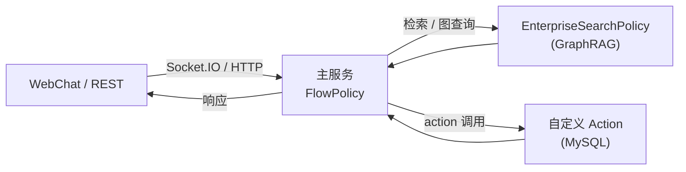

# Rasa ECS 使用教程

本文帮助你快速跑通 Rasa ECS 智能客服，包括模型训练、服务启动、调试方式以及常见问题排查。

## 1. 准备工作

1. 安装依赖  
   ```bash
   conda env create -f environment.yml
   conda activate rasa-ecs
   export RASA_LICENSE=<你的许可证>   # 也可写入 .env
   pip install -r requirements.txt    # 若已安装 ——skip
   ```
2. 配置 `.env`（位于仓库根目录）：
   ```env
   LLM_API_HEALTH_CHECK=true
   API_KEY=<DashScope 或自托管 LLM Key>
   RASA_LICENSE=<同上>
   ```
3. 确保依赖服务可用：MySQL（ecs 库）、Neo4j、嵌入服务（`addons/embed_service.py`）、DashScope/API。

## 2. 训练模型

```bash
conda activate rasa-ecs
set -a && source .env && set +a   # 或使用 scripts/start-*.sh 自动加载
rasa train --config config.yml --domain domain --data data
```

训练完成后会在 `models/` 生成类似 `20251120-120242-contemporary-parameter.tar.gz` 的模型文件，主服务需加载该模型。

## 3. 启动服务

0. **一键启动全部（嵌入服务 + Action Server + 主服务）**
   ```bash
   scripts/start-all.sh
   ```
   - 会先检查/启动嵌入服务（`addons/embed_service.py`，默认端口 `10010`，日志 `/tmp/embed_service.log`），再后台启动 Action Server，最后前台启动主服务。
   - 需要监听端口：10010（嵌入）、5055（actions）、5005（主服务）。如端口冲突，可设置环境变量 `EMBED_PORT`/`EMBED_HOST` 或在命令后追加 `--port` 等参数。

1. **单独启动 Action Server（业务逻辑）**
   ```bash
   scripts/start-actions.sh
   ```
   - 监听 `http://0.0.0.0:5055`
   - 只负责自定义 Action（查询订单/物流、写库等），无需模型

2. **单独启动 Assistant 主服务（Flow + LLM + GraphRAG）**
   ```bash
   scripts/start-assistant.sh
   ```
   - 默认监听 `http://0.0.0.0:5005`
   - 若未传 `--model`/`-m`，脚本会自动加载 `models/` 最新的 `.tar.gz`；如需固定某个模型，可追加 `--model <路径>`

> 提示：以上脚本都会自动 `conda activate rasa-ecs` 并加载 `.env`；如需附加参数，可直接写在脚本命令末尾。

## 4. 如何调试

### 4.1 REST 接口

```bash
curl -X POST http://localhost:5005/webhooks/rest/webhook \
  -H "Content-Type: application/json" \
  -d '{"sender":"test-user","message":"查询我的订单"}'
```

返回格式：

```json
[
  {"recipient_id":"test-user","text":"您好，请先告诉我订单号..."},
  {"recipient_id":"test-user","buttons":[...]}
]
```

### 4.2 WebChat 页面

```bash
cd webchat
python -m http.server 8000
```

浏览器访问 `http://localhost:8000`，右下角按钮使用 `rasa-webchat` 连接主服务（依赖 `credentials.yml` 的 `socketio`配置）。

### 4.3 日志观察

- 主服务日志：`scripts/start-assistant.sh` 控制台
- Action Server：`scripts/start-actions.sh` 控制台
- Neo4j/嵌入服务：参考 `addons/` 下脚本
- 若 WebChat 返回 “Sorry, I am having trouble with that…”，说明 Flow/LLM 异常触发 `pattern_internal_error`，请查看 `/tmp/assistant.log` 中对应时间点的栈信息，重点排查：  
  - `.env` 的 `API_KEY` 是否为真实 DashScope Key  
  - Neo4j、`addons/embed_service.py` 是否已启动  
  - `addons/create_indexing.py` 是否为节点建过向量/全文索引

## 5. 服务功能领域

| 服务/脚本                      | 端口              | 主要功能                                                                 |
|-------------------------------|-------------------|--------------------------------------------------------------------------|
| `scripts/start-all.sh`        | 10010 / 5055 / 5005| 一键启动嵌入服务、Action Server 和主服务（嵌入/Action 后台，主服务前台）    |
| `scripts/start-assistant.sh`  | 5005 (HTTP/Socket)| 提供对话接口、执行 FlowPolicy、调用 LLM/GraphRAG、路由到 Action Server     |
| `scripts/start-actions.sh`    | 5055              | 自定义 Action（查订单/物流、改地址、售后等）和数据库访问                  |
| `addons/embed_service.py`     | 10010（默认）     | FastAPI 嵌入服务，供 EnterpriseSearchPolicy 调用 BGE 模型；默认读仓库内 `models/bge-base-zh-v1.5`（存在自动使用），可用 `EMBED_MODEL_PATH` 指定，缺席时自动回退 HuggingFace `BAAI/bge-base-zh-v1.5` |
| `addons/create_indexing.py`   | Neo4j             | 批量创建向量/全文索引，构建 GraphRAG 数据                                |
| `webchat/index.html`          | 任意静态端口      | 面向 C 端的调试/演示 WebChat（基于 `rasa-webchat`）                       |

消息流转总结：



## 6. 常见问题

1. **No model found**：启动主服务时未指定 `--model` 或 `models/` 目录为空。请先 `rasa train` 并传入生成的 tar.gz。
2. **A Rasa license is required**：未导出 `RASA_LICENSE`。可在 `.env` 配置并 `set -a && source .env`。
3. **pymysql ModuleNotFoundError**：Action Server 依赖 `pymysql`，若缺少请 `pip install pymysql` 并重启。
4. **5055/5005 端口占用**：旧进程未退出，可用 `lsof -i tcp:5055` 查 PID 后 `kill <PID>`。
5. **WebChat 无响应**：确认主服务已启动并加载模型、`credentials.yml` 已启用 `socketio`。

## 7. 关停

在运行脚本的终端使用 `Ctrl+C` 即可退出。若手动启动过后台进程，记得 `kill <PID>` 释放端口。

---

如需进一步问题排查，可查看 `logs/`（若手动指定）、`/tmp/rasa-*.log` 或直接提 issue。欢迎根据业务需求扩展 Web 前端或对接企业 IM。*** End Patch
